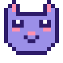

<p align="center">
  
</p>

# kittyview

Display images in your terminal using the [kitty graphics protocol](https://sw.kovidgoyal.net/kitty/graphics-protocol/).

kittyview renders PNG, JPEG, SVG, and many other image formats directly in your terminal. It auto-detects terminal support and produces clean, chunked output that works with large images.

## Supported terminals

kittyview auto-detects support via environment variables. Confirmed compatible terminals:

- [kitty](https://sw.kovidgoyal.net/kitty/)
- [Ghostty](https://ghostty.org/)
- [WezTerm](https://wezfurlong.org/wezterm/)
- [Konsole](https://konsole.kde.org/)
- [iTerm2](https://iterm2.com/)

Use `--force` if your terminal supports the protocol but isn't detected.

## Install

### Pre-built binaries

Download from [GitHub Releases](../../releases) for Linux (amd64, aarch64), macOS (Intel, Apple Silicon), and Windows (amd64, aarch64). Linux binaries are statically linked.

### From source

```
cargo install --path .
```

## Usage

```
# Display an image
kittyview photo.jpg

# Display an SVG diagram
kittyview architecture.svg

# Pipe from another tool
curl -s https://example.com/image.png | kittyview
dot -Tsvg graph.dot | kittyview

# Display the built-in logo
kittyview logo
```

When no file is given and stdin is piped, kittyview reads from stdin automatically. Format is detected from file contents (magic bytes for raster images, `<svg` for SVGs).

### Animated images

By default, animated GIFs display their first frame only. Use `--animate` to play the full animation via the kitty animation protocol:

```
# Play an animated GIF
kittyview --animate nyan.gif

# Animated logo with speech bubble
kittyview --animate logo
```

Animation support requires a terminal with kitty animation protocol support (currently kitty; Ghostty and others may show only the first frame).

### Convert to PNG

The `png` subcommand exports any supported format as a PNG file, useful for debugging or format conversion:

```
# Convert SVG to PNG
kittyview png diagram.svg -o diagram.png

# Export the built-in logo
kittyview png --logo -o logo.png

# Pipe through
dot -Tsvg graph.dot | kittyview png -o graph.png
```

### Shell completions

```
# Bash
kittyview completions bash > ~/.local/share/bash-completion/completions/kittyview

# Zsh
kittyview completions zsh > ~/.local/share/zsh/site-functions/_kittyview

# Fish
kittyview completions fish > ~/.config/fish/completions/kittyview.fish
```

## Supported image formats

| Format   | Extensions                                 |
|----------|--------------------------------------------|
| PNG      | `.png`                                     |
| JPEG     | `.jpg`, `.jpeg`                            |
| GIF      | `.gif`                                     |
| SVG      | `.svg`, `.svgz` (with full text rendering) |
| WebP     | `.webp`                                    |
| BMP      | `.bmp`                                     |
| TIFF     | `.tif`, `.tiff`                            |
| ICO      | `.ico`                                     |
| PNM      | `.ppm`, `.pgm`, `.pbm`                     |
| TGA      | `.tga`                                     |
| QOI      | `.qoi`                                     |
| Farbfeld | `.ff`                                      |
| HDR      | `.hdr`                                     |

SVG files are detected by extension or by content sniffing (`<svg` in the first 1KB).

## SVG resource access

When rendering SVGs, external file references (`<image href="...">`) are blocked by default. Use `--svg-resources` to control this:

| Policy           | Allows                                                     |
|------------------|------------------------------------------------------------|
| `none` (default) | Embedded/inline images only. No file access.               |
| `cwd`            | Files in the current working directory.                    |
| `tree`           | Files in the current working directory and subdirectories. |
| `any`            | Unrestricted file access.                                  |

Data URLs (images embedded directly in the SVG) always work regardless of policy.

For file inputs, relative paths in the SVG resolve from the SVG file's directory. For stdin, they resolve from the current working directory.

```
# Render an SVG that references local images
kittyview --svg-resources tree diagram.svg

# Same via stdin -- relative paths resolve from CWD
cat diagram.svg | kittyview --svg-resources tree
```

## Security

- **Terminal detection**: kittyview refuses to emit escape sequences to non-terminal stdout or unsupported terminals unless `--force` is used. This prevents accidental binary output to files or pipes.
- **Stdin support**: When no file is given and stdin is piped, kittyview reads from stdin. Format is detected from content, not filenames.
- **SVG sandboxing**: External file access from SVGs is blocked by default (`--svg-resources none`). This applies to both file and stdin inputs.
- **SVG size limits**: Oversized SVGs are automatically downscaled (max 8192x8192) to prevent memory exhaustion.
- **Pure Rust**: No C dependencies. The entire dependency tree compiles from Rust source.
- **Crash safety**: Kitty protocol output is fully buffered before writing to minimize partial escape sequences if the process is interrupted.

## Building from source

Requires Rust 1.85+ (edition 2024).

```
cargo build --release
```

Run tests:

```
cargo test
```

## License

Apache-2.0
