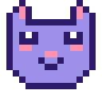

<p align="center">
  
</p>

# kittyview

Display images in your terminal using the [kitty graphics protocol](https://sw.kovidgoyal.net/kitty/graphics-protocol/).

kittyview renders PNG, JPEG, SVG, and many other image formats directly in your terminal. It auto-detects terminal support and produces clean, chunked output that works with large images.

## Supported terminals

kittyview auto-detects support with in-band terminal queries, falling back to environment variables when no terminal I/O is available. Confirmed compatible terminals:

- [kitty](https://sw.kovidgoyal.net/kitty/)
- [Ghostty](https://ghostty.org/)
- [WezTerm](https://wezfurlong.org/wezterm/)
- [Konsole](https://konsole.kde.org/)
- [iTerm2](https://iterm2.com/)

Terminals kittyview cannot identify by name are asked directly, using the graphics protocol's own capability query, so a terminal that implements the protocol generally works without `--force`.

Use `--force` if your terminal supports the protocol but isn't detected.

## Install

### Pre-built binaries

Download from [GitHub Releases](../../releases) for Linux (amd64, aarch64), macOS (Intel, Apple Silicon), and Windows (amd64, aarch64). Linux binaries are statically linked.

### Verifying downloads

Every release binary carries a [build provenance attestation](https://docs.github.com/en/actions/security-guides/using-artifact-attestations-to-establish-provenance-for-builds): a Sigstore-signed record of the workflow, commit and ref that produced it. Verify one with the [GitHub CLI](https://cli.github.com):

```sh
gh attestation verify kittyview-linux-amd64.tar.gz \
  --repo gominimal/kittyview \
  --source-ref refs/tags/v0.1.6 \
  --deny-self-hosted-runners
```

Substitute the tag of the release you downloaded.

`--source-ref` is the part that matters. Without it the policy only checks that *something* in this repository built the artifact, which any build from any branch satisfies -- including the rehearsal runs used to exercise the release workflow, whose attestations outlive the throwaway drafts they were built for. Pinning the tag is what makes a passing check mean "this came from the release it claims to". `--deny-self-hosted-runners` additionally requires the build to have run on GitHub-hosted infrastructure.

Attestations for the repository can also be browsed at [/attestations](../../attestations).

### From source

```
cargo install --path .
```

## Usage

```
# Display an image
kittyview photo.jpg

# Display an SVG diagram
kittyview architecture.svg

# Pipe from another tool
curl -s https://example.com/image.png | kittyview
dot -Tsvg graph.dot | kittyview

# Display the built-in logo
kittyview logo

# Browse several images as a slideshow
kittyview vacation/*.jpg
```

When no file is given and stdin is piped, kittyview reads from stdin automatically. Format is detected from file contents (magic bytes for raster images, `<svg` for SVGs).

### Slideshow

Giving kittyview more than one file opens an interactive slideshow on the terminal's alternate screen: each image is shown fitted to the window and centred, with a status line naming the file and its position in the list.

| Key                              | Action                        |
|----------------------------------|-------------------------------|
| Right, Down, Space, `n`          | next image                    |
| Left, Up, Backspace, `p`         | previous image                |
| Home / End (also PgUp / PgDn)    | first / last image            |
| `r`                              | redraw the slide from scratch |
| Ctrl-Z                           | suspend (resume with `fg`)    |
| `q`, Esc, Ctrl-C                 | quit                          |

Navigation stops at the ends of the list rather than wrapping. Files that fail to load show their error in place and are skipped past with the same keys. `--animate` plays animated slides on terminals that support the kitty animation protocol.

Under tmux, each slide change redraws by way of the pane's main screen -- a brief flash of the pane beneath, and `r` forces the same rebuild by hand. The flash buys reliability twice over: tmux silently drops passthrough sequences around pane redraws (kittyview also verifies each transmission's arrival over the protocol's reply channel, retries losses, and reports them in a diagnostics line on exit), and Ghostty releases through 1.3.1 render placeholder images delivered as in-place pane updates blank -- confirmed with the data verified present in the terminal -- while a full repaint renders them correctly. The same Ghostty releases can also render large placeholder images at the wrong size inside tmux (clipped or narrowed, [ghostty#13056](https://github.com/ghostty-org/ghostty/issues/13056)). Ghostty's nightly builds fix the rendering; kitty is unaffected.

The slideshow leaves the terminal exactly as it found it, on every exit path: quitting, errors, panics, and fatal signals all restore the screen, the cursor, and the terminal mode, and delete the transmitted images so the terminal's image memory is returned. `kill -9` is the one exit nothing can clean up after -- `reset` recovers the terminal if it comes to that. Ctrl-Z suspends and resumes like any well-behaved fullscreen program.

Two caveats: inside GNU screen the alternate screen is off unless `altscreen on` is set in `.screenrc`, so the slideshow draws on the main screen and its final frame stays in scrollback on exit; and slideshow mode is not available on Windows, where no native terminal currently displays kitty graphics from a local process (WSL works).

### Animated images

By default, animated GIFs display their first frame only. Use `--animate` to play the full animation via the kitty animation protocol:

```
# Play an animated GIF
kittyview --animate nyan.gif

# Animated logo with speech bubble
kittyview --animate logo
```

Animation needs the kitty *animation* protocol, which is separate from kitty graphics support and much rarer. kitty plays animations, and WezTerm plays the transmitted frames (it ignores only the animation-control sequence, so the first frame's delay may be off). Konsole and iTerm2 ignore the animation sequences entirely, Ghostty rejects them before 1.4.0, and Zellij rejects them whatever terminal it runs in -- each of these shows only a static first frame. The protocol offers no capability query for animation, so kittyview warns where it positively knows the animation will not play, and gives terminals it does not recognise the benefit of the doubt.

### Terminal multiplexers

kittyview works inside tmux, GNU screen, and zellij. Multiplexer layers are auto-detected with in-band terminal queries, and graphics sequences are wrapped in DCS passthrough envelopes so they reach the outer terminal. Nested layers (tmux-in-tmux, tmux-in-screen) are detected and wrapped for each level.

tmux drops passthrough sequences unless it is configured to forward them:

```
# ~/.tmux.conf
set -g allow-passthrough on
```

kittyview warns when it detects that this setting is off, since the symptom is otherwise an image that simply never appears.

#### Zellij

Zellij implements the kitty graphics protocol itself from version 0.45.0, drawing the images rather than passing the sequences through, so no passthrough wrapping is involved. kittyview detects Zellij and its version, and asks Zellij directly whether an image can be drawn -- `--force` is not needed.

Two things follow from Zellij drawing the images itself:

- Images are placed directly under Zellij, whatever `--placement auto` would otherwise choose. Zellij does not implement Unicode placeholder cells and rejects placements that use them, so a placeholder grid would appear as literal glyphs instead of an image. `--placement unicode` still overrides this, but has nothing to draw with.
- Zellij only draws images when the terminal *it* runs in supports the protocol, and when `support_kitty_graphics_protocol` has not been set to `false` in its config. kittyview reports either case instead of emitting sequences nothing will draw.

Zellij before 0.45.0 does not implement the protocol at all. kittyview says so and names the version it found.

Detection can be overridden with `--passthrough`:

```
# Skip detection and assume no multiplexer
kittyview --passthrough off photo.jpg

# Specify the stack explicitly, outermost last
kittyview --passthrough tmux photo.jpg
kittyview --passthrough tmux,screen photo.jpg
```

### Image placement

Images can be anchored to the screen two ways, selected with `--placement`:

| Mode                | Behaviour                                                                   |
|---------------------|-----------------------------------------------------------------------------|
| `auto` (default)    | Unicode placeholders where the terminal supports them, direct otherwise.     |
| `unicode`           | Always anchor to Unicode placeholder cells.                                  |
| `direct`            | Always let the terminal position the image itself.                           |

With `direct` placement the terminal owns the image's position, so it stays pinned where it was first drawn while the text around it scrolls away. Unicode placeholders occupy ordinary text cells, so the image scrolls, clips, and redraws with the surrounding output -- which is what makes images behave correctly under multiplexers and pagers.

`auto` uses placeholders everywhere except Konsole, iTerm2, and Zellij, which do not implement them.

### Convert to PNG

The `png` subcommand exports any supported format as a PNG file, useful for debugging or format conversion:

```
# Convert SVG to PNG
kittyview png diagram.svg -o diagram.png

# Export the built-in logo
kittyview png --logo -o logo.png

# Pipe through
dot -Tsvg graph.dot | kittyview png -o graph.png
```

### Shell completions

```
# Bash
kittyview completions bash > ~/.local/share/bash-completion/completions/kittyview

# Zsh
kittyview completions zsh > ~/.local/share/zsh/site-functions/_kittyview

# Fish
kittyview completions fish > ~/.config/fish/completions/kittyview.fish
```

## Supported image formats

| Format   | Extensions                                 |
|----------|--------------------------------------------|
| PNG      | `.png`                                     |
| JPEG     | `.jpg`, `.jpeg`                            |
| GIF      | `.gif`                                     |
| SVG      | `.svg`, `.svgz` (text rendering, see [SVG notes](#svg-text-rendering)) |
| WebP     | `.webp`                                    |
| BMP      | `.bmp`                                     |
| TIFF     | `.tif`, `.tiff`                            |
| ICO      | `.ico`                                     |
| PNM      | `.ppm`, `.pgm`, `.pbm`                     |
| TGA      | `.tga`                                     |
| QOI      | `.qoi`                                     |
| Farbfeld | `.ff`                                      |
| HDR      | `.hdr`                                     |

SVG files are detected by extension or by content sniffing (`<svg` in the first 1KB).

## SVG text rendering

kittyview renders SVGs using [resvg](https://github.com/linebender/resvg), which supports native SVG `<text>` elements out of the box.

Many tools (mermaid-cli, draw.io, D3.js) generate SVGs that use `<foreignObject>` with embedded HTML for text labels instead of native `<text>` elements. kittyview detects these and converts them to `<text>` on a best-effort basis. This covers the common cases well, but has some limitations:

- **Text wrapping**: HTML text that relies on CSS word-wrap (without explicit `<br>` tags) will render as a single line. Most mermaid diagrams use `<br>` and are unaffected.
- **Rich formatting**: Bold, italic, and per-element font size or color differences inside labels are not preserved. The global font and color from the SVG's stylesheet are used.
- **Structural HTML**: Tables, lists, and nested divs are rendered as readable plain text (cells separated by tabs, rows and list items on separate lines) but without visual table/list formatting. MathML and form elements are not supported.
- **Edge label backgrounds**: Semi-transparent background rectangles behind edge labels are not reproduced.

SVGs that already use native `<text>` elements (e.g. Inkscape, some mermaid-cli configurations) render without these limitations.

## SVG resource access

When rendering SVGs, external file references (`<image href="...">`) are blocked by default. Use `--svg-resources` to control this:

| Policy           | Allows                                                     |
|------------------|------------------------------------------------------------|
| `none` (default) | Embedded/inline images only. No file access.               |
| `cwd`            | Files in the current working directory.                    |
| `tree`           | Files in the current working directory and subdirectories. |
| `any`            | Unrestricted file access.                                  |

Data URLs (images embedded directly in the SVG) always work regardless of policy.

For file inputs, relative paths in the SVG resolve from the SVG file's directory. For stdin, they resolve from the current working directory.

```
# Render an SVG that references local images
kittyview --svg-resources tree diagram.svg

# Same via stdin -- relative paths resolve from CWD
cat diagram.svg | kittyview --svg-resources tree
```

## Security

- **Terminal detection**: kittyview refuses to emit escape sequences to non-terminal stdout or unsupported terminals unless `--force` is used. This prevents accidental binary output to files or pipes.
- **Stdin support**: When no file is given and stdin is piped, kittyview reads from stdin. Format is detected from content, not filenames.
- **SVG sandboxing**: External file access from SVGs is blocked by default (`--svg-resources none`). This applies to both file and stdin inputs.
- **SVG size limits**: Oversized SVGs are automatically downscaled (max 8192x8192) to prevent memory exhaustion.
- **Pure Rust**: No C dependencies. The entire dependency tree compiles from Rust source.
- **Crash safety**: Kitty protocol output is fully buffered before writing to minimize partial escape sequences if the process is interrupted.
- **Signed provenance**: release binaries carry Sigstore-signed build provenance attestations, so a download can be traced to the workflow, commit and tag that built it. See [Verifying downloads](#verifying-downloads).

## Building from source

Requires Rust 1.87+ (edition 2024).

```
cargo build --release
```

Run tests:

```
cargo test
```

## License

Apache-2.0
